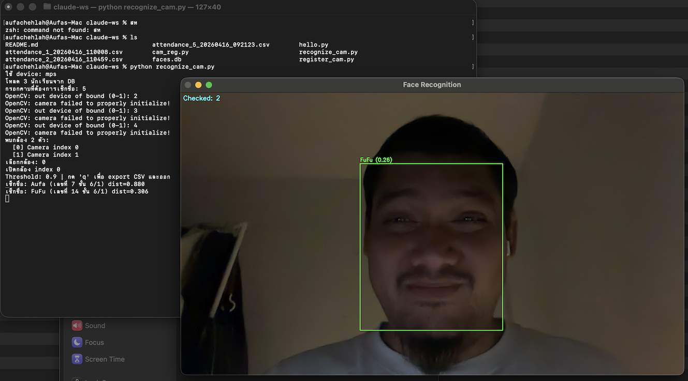

# ระบบเช็กชื่อด้วยการจดจำใบหน้า



ระบบลงทะเบียนและเช็กชื่อนักเรียนผ่านกล้อง โดยใช้ FaceNet (InceptionResnetV1) และ MTCNN สำหรับตรวจจับและเปรียบเทียบใบหน้า

---

## ความต้องการของระบบ

- Python 3.10+
- `opencv-python`
- `torch`
- `facenet-pytorch`
- `Pillow`
- `numpy`

ติดตั้ง dependency:
```bash
pip install opencv-python torch facenet-pytorch Pillow numpy
```

---

## register_cam.py — ลงทะเบียนนักเรียน

สคริปต์สำหรับถ่ายภาพและบันทึก embedding ใบหน้าของนักเรียนลงในฐานข้อมูล `faces.db`

### วิธีใช้

```bash
python register_cam.py
```

### ขั้นตอนการทำงาน

1. **เลือกกล้อง** — หากมีกล้องหลายตัว ระบบจะแสดงรายการให้เลือก
2. **กรอกชั้นปี** — ใช้ร่วมกันทุกคนในรอบการลงทะเบียนนั้น
3. **กรอกข้อมูลนักเรียน** — ชื่อ-สกุล และเลขที่
4. **ถ่ายภาพ** — ระบบแสดง preview พร้อม bounding box เมื่อตรวจพบใบหน้า
   - กด `SPACE` — ถ่ายภาพและบันทึก embedding
   - กด `n` — ข้ามไปกรอกข้อมูลคนถัดไปโดยไม่บันทึก
   - กด `q` — ออกจากโปรแกรม
5. **ยืนยัน** — หลังบันทึกสำเร็จ เลือกลงทะเบียนคนถัดไป (y) หรือออก (n)

> ระบบตรวจสอบว่าเลขที่ซ้ำหรือไม่ ถ้าเคยลงทะเบียนแล้วจะไม่อนุญาตให้บันทึกซ้ำ

---

## recognize_cam.py — เช็กชื่อนักเรียน

สคริปต์สำหรับจดจำใบหน้าแบบ real-time ผ่านกล้อง และ export ผลเป็นไฟล์ CSV

### วิธีใช้

```bash
python recognize_cam.py
```

### ขั้นตอนการทำงาน

1. **โหลดข้อมูล** — ดึง embedding ของนักเรียนทุกคนจาก `faces.db`
2. **กรอกคาบ** — ระบุหมายเลขคาบที่ต้องการเช็กชื่อ
3. **เลือกกล้อง** — หากมีกล้องหลายตัว ระบบจะแสดงรายการให้เลือก
4. **จดจำใบหน้า** — ระบบสแกนทุก frame แบบ real-time
   - กรอบ **เขียว** + ชื่อ → จดจำได้
   - กรอบ **แดง** + "Unknown" → ไม่รู้จัก
   - มุมบนซ้ายแสดงจำนวนคนที่เช็กชื่อแล้ว
5. **กด `q`** — หยุดและ export ผลลัพธ์เป็น CSV

### ไฟล์ผลลัพธ์

ชื่อไฟล์: `attendance_{คาบ}_{วันเวลา}.csv`

| student_no | name | year | period | seen_at |
|---|---|---|---|---|
| 1 | สมชาย ใจดี | 3 | 2 | 2026-04-16T10:30:00 |

> แต่ละคนจะถูกบันทึกเพียงครั้งเดียว แม้ใบหน้าจะปรากฏในหลาย frame (deduplication ด้วย student_no + year)

---

## การทำงานของ AI

| ส่วน | รายละเอียด |
|---|---|
| ตรวจจับใบหน้า | MTCNN (ทำงานบน CPU) |
| สร้าง embedding | FaceNet — InceptionResnetV1 pretrained บน VGGFace2 |
| เปรียบเทียบ | Cosine distance (threshold = 0.9) |
| Hardware | รองรับ Apple MPS, CUDA, และ CPU |

---

## โครงสร้างไฟล์

```
.
├── register_cam.py   # ลงทะเบียนนักเรียน
├── recognize_cam.py  # เช็กชื่อนักเรียน
├── cam_reg.py        # ยูทิลิตี้ทดสอบกล้อง
├── faces.db          # ฐานข้อมูล embedding (สร้างอัตโนมัติ)
└── attendance_*.csv  # ผลการเช็กชื่อ (สร้างอัตโนมัติ)
```
